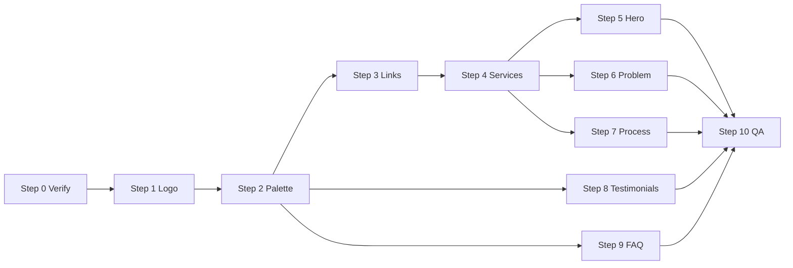

# Margaux Prototype — UI Revamp Playbook

**Project:** `v0-margaux-dog-trainer-prototype`  
**Purpose:** Step-by-step playbook to polish visual identity, interaction patterns, and key homepage sections after the initial 21st.dev layout pass (`REVAMP_STRATEGY.md`).  
**Usage:** Run one step per chat session. Paste the **Prompt** block verbatim. Complete `REVAMP_STRATEGY.md` Step 0 first if not already done.

**Companion docs:**

- [`REVAMP_STRATEGY.md`](REVAMP_STRATEGY.md) — initial layout revamp (bento, hero split, marquees)
- This file — palette, logo, links/cursors, section density, motion, testimonials, FAQ

---

## Table of contents

1. [Design north star](#design-north-star)
2. [How to use this document](#how-to-use-this-document)
3. [MCP tools](#mcp-tools)
4. [Global guardrails](#global-guardrails)
5. [Step 0 — Prerequisites (verify)](#step-0--prerequisites-verify)
6. [Step 1 — Logo (transparent PNG)](#step-1--logo-transparent-png)
7. [Step 2 — Color palette (graduation-cap dog)](#step-2--color-palette-graduation-cap-dog)
8. [Step 3 — Links, underlines, paw cursor](#step-3--links-underlines-paw-cursor)
9. [Step 4 — IconTitleRow + services bento](#step-4--icontitlerow--services-bento)
10. [Step 5 — Hero (21st Hero Section 9)](#step-5--hero-21st-hero-section-9)
11. [Step 6 — Problem section (2×2 grid)](#step-6--problem-section-22-grid)
12. [Step 7 — Process section (layout + animation)](#step-7--process-section-layout--animation)
13. [Step 8 — Testimonials (unique avatars)](#step-8--testimonials-unique-avatars)
14. [Step 9 — FAQ (split layout + connected accordion)](#step-9--faq-split-layout--connected-accordion)
15. [Step 10 — Final QA pass](#step-10--final-qa-pass)

---

## Design north star

### What this revamp fixes

| Issue (screenshots / review) | Root cause | Target |
|---|---|---|
| Underlines on cards, prices, links | Block `<Link>` without `no-underline`; shadcn defaults | No underlines site-wide; hover = color change only |
| Icon above title | Stacked flex layout in bento cells | Icon + title on **same line**; description below |
| Services bento feels empty | Only flagship cell has `service.image` | **Every** service cell shows a photo thumbnail |
| Hero feels busy | Stats ×3 (inline row, marquee, ribbon) + contact footer | 21st Hero Section 9 layout — editorial collage, one CTA, stats elsewhere |
| Problem bento feels empty | Asymmetric 4×2 cell with sparse content | Balanced 2×2 grid with denser copy |
| Process section static | No scroll motion; icon stacked above title | Scroll-reveal stagger + inline icon/title |
| Testimonials 2 & 3 same photo | Hardcoded `index === 0 ? dog-1 : dog-2` | Unique `image` per testimonial in data |
| FAQ boring | Centered header + spaced floating cards | Split layout + connected accordion panel |
| Wrong brand colors | Sage/terracotta from v0 defaults | Navy/ginger/cream from logo illustration |

### North star (non-negotiable)

- **Brand from the logo illustration** — navy cap, ginger fur, warm cream, sandy tan surfaces.
- **Information first** — pricing, services, contact still scannable in under 10 seconds.
- **One dramatic homepage entrance** — hero mount animation only (Hero Section 9 text + collage reveal); other sections use scroll-triggered or hover motion.
- **No underline decoration** on links or buttons; paw cursor on all buttons.
- Still a **demo prototype** — fictitious content, cookie banner, demo chat widget OK.

### New brand tokens (replace sage/terracotta)

Source: `public/images/new-logo.jpeg` (graduation-cap dog illustration)

| Illustration | Hex | CSS token role |
|---|---|---|
| Sandy tan | `#D9B99B` | `--card`, surface tints, borders |
| Ginger orange | `#C87D32` | `--accent` (CTAs, prices, stars) |
| Warm cream | `#F5E6D3` | `--background` |
| Navy cap | `#1A2B44` | `--primary` (icons, ribbons, headings accent) |
| Gold tassel | `#C68E4E` | `--ring`, chart accents |
| Dark outline | `#2F2A26` | `--foreground` |

Fonts unchanged: **Nunito** (headings), **DM Sans** (body).

---

## How to use this document

1. **Always work inside** `v0-margaux-dog-trainer-prototype/` (project root).
2. Run steps **in order** — palette and logo before section work; `IconTitleRow` (Step 4) before Steps 6–7.
3. For each step:
   - Call the indicated **MCP tool** with the **search query** when listed.
   - Paste the **Prompt** into a new agent chat with `@v0-margaux-dog-trainer-prototype` attached.
   - Run `npm run lint && npm run build` before moving on.
4. Add new copy to **both** `messages/fr.ts` and `messages/en.ts`.
5. Use `@/lib/navigation` for links — not `next/link` directly.
6. Use `next-intl` — never hardcode French/English in components.

### Recommended session batching

| Batch | Steps | ~Effort |
|---|---|---|
| Brand foundation | 1 → 2 → 3 | 1 session |
| Layout + motion | 4 → 5 → 6 → 7 | 1–2 sessions |
| Social + FAQ | 8 → 9 | 1 session |
| QA | 10 | 1 session |

---

## MCP tools

| Tool | Server | When to use |
|---|---|---|
| `21st_magic_component_inspiration` | Magic MCP | Browse layouts before building (hero, bento, FAQ, process) |
| `21st_magic_component_builder` | Magic MCP | Generate a new component snippet for a target file |
| `21st_magic_component_refiner` | Magic MCP | Redesign an **existing** component file |
| `searchRegistryItems` | `@magicuidesign/mcp` | Search Magic UI Pro registry (limited hero/bento items) |

**After any MCP call:** adapt snippets to Margaux tokens, i18n, and existing shadcn components. Never paste demo text (“Efferd”, “Tailus”, shipping FAQs, etc.).

---

## Global guardrails

Every step inherits these rules.

### Links and buttons

- **No underlines** anywhere (including blog, footer credits, accordion triggers, card links).
- **Link hover:** change text color (`hover:text-primary` or `hover:text-accent`) — not decoration.
- **Buttons:** paw cursor on hover/focus (`/paw-cursor.png`, `/paw-cursor-light.png` in dark mode).

### Motion

- Respect `prefers-reduced-motion` via `useReducedMotion()` / `useFadeUpReveal`.
- **Max one** dramatic mount animation on homepage (hero text stagger + image collage reveal).
- Process section: scroll-triggered stagger OK; no infinite loops, progress bars, or parallax.
- Marquees (if kept): `pauseOnHover`, 28–40s duration, `motion-reduce:animate-none`.

### Accessibility

- Ginger CTAs on cream: WCAG AA contrast — use white `--accent-foreground` if needed.
- FAQ: `type="single" collapsible` — one item open at a time.
- All images: meaningful `alt` (from i18n or data).

### Dependencies

- Do **not** add new deps unless strictly required.
- Reuse: `framer-motion`, `lucide-react`, shadcn/ui, Radix.

### Code conventions

- `'use client'` only where needed.
- Booking CTAs: always `OpenBookingLink` from `@/components/booking`.
- Shared layout primitive: `IconTitleRow` in `components/shared/icon-title-row.tsx` (created Step 4).

---

## Step 0 — Prerequisites (verify)

**Goal:** Confirm the codebase is stable before UI polish. If `REVAMP_STRATEGY.md` Step 0 was never run, run it first.

**MCP tool:** *(none)*

**Success criteria:**

- `npm run dev` and `npm run build` succeed
- Booking modal opens on **current page** from every CTA (`OpenBookingLink`)
- Cookie banner z-index below booking modal
- No duplicate lockfiles / Turbopack root warnings

### Prompt

```
@v0-margaux-dog-trainer-prototype

UI_REVAMP.md Step 0 — verify prerequisites.

If REVAMP_STRATEGY.md Step 0 was never completed, apply it fully (OpenBookingLink, turbopack root, cookie z-index, mobile CTA/chat overlap).

Otherwise, only verify:
- npm run lint && npm run build pass
- OpenBookingLink used everywhere (grep for pathname: '/' with booking query — should be zero)
- public/paw-cursor.png and public/paw-cursor-light.png exist (create simple paw PNGs if missing)

Report status; fix blockers only. Do not start UI_REVAMP Steps 1+ yet if build fails.
```

---

## Step 1 — Logo (transparent PNG)

**Goal:** Replace generic brand mark with cropped graduation-cap dog from `new-logo.jpeg`.

**21st search query:** *(none — asset processing)*  
**MCP tool:** *(none)*

**Input:** `public/images/new-logo.jpeg`  
**Output:** `public/brand-logo.png` (transparent background, tight crop)

**Files:**

- `public/images/new-logo.jpeg` *(source)*
- `public/brand-logo.png` *(replace)*
- `components/layout/brand-logo.tsx`
- `lib/read-brand-logo.ts`
- `app/icon.tsx`, `app/apple-icon.tsx`

**Keep:** Dynamic favicon pipeline via `readBrandLogoDataUri()`.

**Avoid:** JPEG logo in navbar; dark-mode invert filter (logo has intentional colors).

### How

1. **Remove background** — sandy tan `~#D9B99B`:
   - ImageMagick: `convert public/images/new-logo.jpeg -fuzz 12% -transparent '#D9B99B' ...`
   - Or Python `rembg` for cleaner edges around black outlines
2. **Trim/crop** — tight bounding box around dog head + cap; minimal padding
3. **Export** — PNG ~512×512, square canvas, logo centered
4. **Replace** `public/brand-logo.png`
5. **Update** `BrandLogo` — remove `dark:brightness-0 dark:invert`; optionally `size-10` in navbar
6. **Verify** favicon at `/icon` and Apple touch icon

### Prompt

```
@v0-margaux-dog-trainer-prototype

UI_REVAMP.md Step 1 — Logo PNG.

1. Process public/images/new-logo.jpeg:
   - Remove tan background (#D9B99B) → transparent PNG
   - Trim/crop tightly around dog head + graduation cap
   - Save as public/brand-logo.png (~512×512)

2. Update components/layout/brand-logo.tsx:
   - Remove dark:brightness-0 dark:invert (colored logo displays as-is)
   - Keep alt "Margaux — éducatrice canine"

3. Verify app/icon.tsx and app/apple-icon.tsx still render from brand-logo.png

4. Visually check navbar + footer logo at light and dark mode

Run npm run lint && npm run build.
```

---

## Step 2 — Color palette (graduation-cap dog)

**Goal:** Remap CSS variables from sage/terracotta to navy/ginger/cream palette.

**21st search query:** *(none)*  
**MCP tool:** *(none)*

**Files:**

- `app/globals.css` — `:root`, `.dark`, `@theme inline`, `.brand-section-gradient`, `.surface-*`
- `app/layout.tsx` — `themeColor`
- `REVAMP_STRATEGY.md` — update brand token table when done (optional doc sync)

**Token mapping:**

| Token | New direction |
|---|---|
| `--background` | Warm cream `#F5E6D3` (OKLCH) |
| `--foreground` | Dark brown `#2F2A26` |
| `--card` | Sandy tan tint `#D9B99B` at low opacity or solid cream variant |
| `--primary` | Navy `#1A2B44` |
| `--primary-foreground` | White or cream |
| `--accent` | Ginger `#C87D32` |
| `--accent-foreground` | White (verify AA on buttons) |
| `--ring` | Gold `#C68E4E` |
| `--border` | Tan/cream subtle |

**Avoid:** Keeping old `#A8B5A2` sage or `#C38E70` terracotta anywhere in variables.

### Prompt

```
@v0-margaux-dog-trainer-prototype

UI_REVAMP.md Step 2 — Color palette.

Remap app/globals.css CSS variables to the graduation-cap dog palette:
- background: cream #F5E6D3
- foreground: #2F2A26
- primary: navy #1A2B44
- accent: ginger #C87D32
- card/border/surface utilities: sandy tan #D9B99B tints
- ring: gold #C68E4E

Update .brand-section-gradient, .surface-cream, .surface-sage, .surface-terracotta to use new tokens (rename semantics if sage/terracotta names are misleading — e.g. surface-navy, surface-ginger, or keep class names but change colors).

Update app/layout.tsx themeColor to #1A2B44.

Verify accent CTA buttons meet WCAG AA on cream background.

Run npm run lint && npm run build. Spot-check homepage sections for contrast regressions.
```

---

## Step 3 — Links, underlines, paw cursor

**Goal:** Site-wide link/button interaction polish.

**21st search query:** *(none)*  
**MCP tool:** *(none)*

**Files:**

- `app/globals.css` — base `a` styles; button paw cursor dark mode
- `components/ui/button.tsx` — remove link variant underline; add paw cursor classes
- `components/ui/accordion.tsx` — remove default `hover:underline`
- `components/layout/navbar.tsx`, `footer.tsx` — designcanin credit links
- `components/blog/blog-post-body.tsx`
- `components/ui/empty.tsx`, `field.tsx`, `item.tsx`
- Any card `<Link>` wrappers (services-preview, service-card, breadcrumbs)

### How

**Global links** in `@layer base`:

```css
a {
  @apply no-underline transition-colors;
}
a:not([data-slot="button"]):hover {
  @apply text-primary;
}
```

**Buttons** — add to `buttonVariants` base string:

```
hover:cursor-[url('/paw-cursor.png')_12_17,pointer]
focus-visible:cursor-[url('/paw-cursor.png')_12_17,pointer]
```

Dark mode in `globals.css`:

```css
.dark [data-slot="button"]:hover,
.dark [data-slot="button"]:focus-visible {
  cursor: url('/paw-cursor-light.png') 12 17, pointer !important;
}
```

Remove redundant per-component `cursor-booking-hover` once global rule works.

**Root cause (service cards):** `<Link className="group block ...">` without `no-underline` underlines all child text including price.

### Prompt

```
@v0-margaux-dog-trainer-prototype

UI_REVAMP.md Step 3 — Links, underlines, paw cursor.

1. app/globals.css — global no-underline on anchors; hover:text-primary for non-button links; dark-mode paw cursor on [data-slot="button"]

2. components/ui/button.tsx:
   - link variant: remove hover:underline, use hover:text-primary
   - all variants: paw cursor on hover/focus-visible

3. components/ui/accordion.tsx — remove hover:underline from AccordionTrigger default

4. Remove underlines from: navbar/footer designcanin links, blog-post-body markdown links (use hover:text-accent font-medium), empty/field/item [&>a]:underline selectors

5. Add no-underline to all block Link wrappers in services-preview, service-card, breadcrumbs

6. Grep for "underline" in components/ — fix remaining instances except comments

7. Remove cursor-booking-hover from components if redundant (optional cleanup)

Ensure public/paw-cursor.png and paw-cursor-light.png exist.

Run npm run lint && npm run build. Verify service card prices and titles have NO underline at rest or hover.
```

---

## Step 4 — IconTitleRow + services bento

**Goal:** Shared icon+title row primitive; every services bento cell shows photo + inline icon/title.

**21st search query:** `bento grid features`  
**MCP tool:** `21st_magic_component_refiner`  
**Target files:**

- `components/shared/icon-title-row.tsx` *(create)*
- `components/home/services-preview.tsx`

**21st reference:** Bento Monochrome cell header (`flex items-start gap-4`) — layout only, not dark theme or animations.

**Data:** All 6 services already have `image` in `lib/data/services-fr.ts` / `services-en.ts`:

- `/images/service-education.jpg`
- `/images/service-rappel.jpg`
- `/images/service-agility.jpg`
- `/images/service-reeducation.jpg`
- `/images/service-promenades.jpg`
- `/images/service-garde.jpg`

**Current bug:** `buildServiceFeatures()` in `services-preview.tsx` only renders `service.image` for flagship; small cells show orphaned icon row at bottom.

**Target cell layout (every service):**

```
[icon]  Éducation de Base     ← IconTitleRow
Les fondations…               ← tagline (description slot)
[16/10 image thumbnail]       ← service.image (ALL cells)
dès 60 €                      ← price, no underline
```

**Keep:** Bento spans (flagship `md:col-span-4 md:row-span-2`, others `md:col-span-2`), rating strip, `OpenBookingLink`, `getServices(locale)`.

**Avoid:** Removing bento asymmetry; external demo images.

### IconTitleRow API (suggested)

```tsx
interface IconTitleRowProps {
  icon: LucideIcon
  title: React.ReactNode
  iconClassName?: string
  titleClassName?: string
}
// Renders: flex items-center gap-3, icon in h-10 w-10 rounded-xl bg-primary/10
```

### Prompt

```
@v0-margaux-dog-trainer-prototype

UI_REVAMP.md Step 4 — IconTitleRow + services bento.

Use 21st.dev MCP (optional): 21st_magic_component_inspiration searchQuery "bento grid features" for cell layout ideas only.

1. CREATE components/shared/icon-title-row.tsx:
   - Props: icon (LucideIcon), title (ReactNode), optional classNames
   - Layout: flex items-center gap-3; icon box h-10 w-10 rounded-xl bg-primary/10; title font-heading font-semibold

2. REWRITE components/home/services-preview.tsx buildServiceFeatures():
   - Every cell (flagship + small): IconTitleRow with service icon + shortTitle
   - Every cell: aspect-[16/10] Image using service.image (flagship larger span, small cells compact thumbnail)
   - Tagline in description; price row below image with formatFromPrice
   - All Link wrappers: no-underline; flex flex-col h-full; mt-auto on price row
   - REMOVE orphaned icon-only footer row from small cells
   - Keep BentoGridWithFeatures, existing col-spans, rating strip, OpenBookingLink, allServices button

3. Export IconTitleRow from components/shared/ if index exists, or import directly.

Run npm run lint && npm run build. Verify at 375px and 1280px: all 6 cells show photos; icon+title same line; no underlines.
```

---

## Step 5 — Hero (21st Hero Section 9)

**Goal:** Replace the cluttered split hero with [Hero Section 9](https://21st.dev/community/components/ravikatiyar/hero-section-9/default) (`ravikatiyar/hero-section-9`) — two-column layout, animated copy, image collage — **adapted** so it reads as native Margaux UI, not a pasted 21st demo.

**21st reference:** [Hero Section 9](https://21st.dev/community/components/ravikatiyar/hero-section-9/default) — left: badge/title/subtitle/actions/stats row; right: staggered 3-image collage with framer-motion.

**Install (from project root):**

```bash
npx shadcn@latest add https://21st.dev/r/ravikatiyar162/hero-section-9
```

**MCP tool:** `21st_magic_component_builder` *(optional — use if shadcn install fails; otherwise adapt the installed file)*  
**21st search query:** `hero section warm` *(inspiration only — Hero Section 9 is the fixed reference)*

**Target files:**

- `components/ui/hero-section-9.tsx` *(installed by shadcn — adapt in place)*
- `components/home/hero-section.tsx` *(rewrite as thin Margaux wrapper)*

**Remove from current hero** (noise + duplication):

| Remove | Reason |
|---|---|
| Inline stats row (200+, 5 years, stars) | Trust section / elsewhere covers social proof |
| `StatsMarquee` component + strip | Duplicates stats |
| Hero contact footer (email, phone, location) | Navbar + footer already show contact |
| Decorative divider (`h-1 w-16`) | Visual noise |
| Secondary booking CTA above fold | Booking in navbar + floating CTA |
| Single-image clip-path column | Replaced by Hero Section 9 collage |

**Keep below hero:** `BrandRibbon` — brand values only; no numeric stats.

### Make it feel native (not “imported”)

The 21st component ships with EduFlex-style defaults (generic grays, demo stats, Unsplash URLs). **Do not ship it unchanged.** Treat `hero-section-9.tsx` as a layout shell; restyle and rewire through `hero-section.tsx`.

| 21st default | Margaux adaptation |
|---|---|
| Generic `bg-background` / muted grays | Wrap in `brand-section-gradient`; cream `#F5E6D3` surfaces from Step 2 |
| Demo title (“A new way to learn…”) | `useTranslations('hero')`: `badge`, `titleBefore` / `titleHighlight` / `titleAfter`, `intro` |
| Generic `Button` styling | shadcn `Button`: primary CTA `bg-accent text-accent-foreground` → `Link href="/services"`; paw cursor from Step 3 |
| Two demo `onClick` actions | **One** primary CTA above fold (`t('cta')` + `ArrowRight`); drop secondary or move booking below fold |
| Stats row (students, tutors, resources) | **Remove numeric stats** from hero (north star) — omit the stats prop entirely, or replace with 2–3 **non-numeric** trust chips if the layout feels empty (e.g. “Éducation positive · Lyon 7e · Sur mesure” from i18n — not 200+/5 ans/4.9) |
| Unsplash collage URLs | Project assets only (see table below) |
| Default sans / tight demo spacing | `font-heading` (Nunito) on h1; body `text-muted-foreground`; match `max-w-6xl` + `p-6 sm:p-8 md:p-10` padding used elsewhere |
| Hard corners / flat cards | `rounded-2xl border border-primary/15 shadow-sm` on collage frames; `surface-sage` or `bg-card/50` tints on image shells |
| Aggressive motion everywhere | Keep Hero Section 9 mount stagger as the **single** homepage entrance; respect `useReducedMotion()` — static layout when reduced motion is on |

### Image collage — project assets only

Pass **three local paths** to the `images` prop. Pick photos that tell the story (trainer + happy dogs + training in action):

| Collage slot | Suggested asset | Role |
|---|---|---|
| Primary (largest) | `/images/hero-margaux.jpg` | Margaux with a dog — hero anchor |
| Secondary | `/images/trainer-action.jpg` | Training session in the field |
| Tertiary | `/images/happy-dog-1.jpg` | Happy client dog / emotional payoff |

**Alternatives** (same breed/energy, no external URLs): `happy-dog-2.jpg`, `service-education.jpg`, `service-rappel.jpg`.

**Images:**

- Use `next/image` with meaningful `alt` from `t('imageAlt')` on the primary frame; add optional `hero.collageAlt2`, `hero.collageAlt3` in `messages/fr.ts` + `en.ts` for the other two.
- `sizes` tuned for ~45% column width on desktop; `priority` on the primary image only.

### Suggested wrapper shape

`hero-section.tsx` should stay the public API (`export function HeroSection`) used by `app/[locale]/page.tsx`. It composes the adapted primitive:

```tsx
// components/home/hero-section.tsx — illustrative only
import HeroSection9 from '@/components/ui/hero-section-9'

export function HeroSection() {
  const t = useTranslations('hero')
  return (
    <section className="brand-section-gradient relative overflow-hidden">
      <HeroSection9
        badge={…}           // Star + t('badge') — match current pill style
        title={…}           // titleBefore + highlight + titleAfter
        subtitle={t('intro')}
        actions={[…]}       // single primary → /services
        images={[
          '/images/hero-margaux.jpg',
          '/images/trainer-action.jpg',
          '/images/happy-dog-1.jpg',
        ]}
        // stats omitted — or trust chips, not numbers
      />
    </section>
  )
}
```

Refactor `hero-section-9.tsx` props/types as needed (e.g. accept `badge: ReactNode`, drop `stats` requirement) so the wrapper stays clean. **Do not** hardcode French/English inside the UI primitive.

**Avoid:** Unsplash URLs; EduFlex copy; triple stat surfaces; hero contact footer; second above-fold booking button; dark/neon 21st theming.

### Prompt

```
@v0-margaux-dog-trainer-prototype

UI_REVAMP.md Step 5 — Hero (21st Hero Section 9).

Reference: https://21st.dev/community/components/ravikatiyar/hero-section-9/default

1. Install the component (if not present):
   npx shadcn@latest add https://21st.dev/r/ravikatiyar162/hero-section-9

2. ADAPT components/ui/hero-section-9.tsx to Margaux design tokens (Step 2 palette):
   - font-heading on title; cream/navy/ginger colors; rounded-2xl bordered image frames
   - Replace any demo/Unsplash assumptions with next/image-friendly local paths
   - Respect useReducedMotion — no stagger when reduced motion preferred
   - Optional: make stats prop optional; when omitted, hide the stats row entirely

3. REWRITE components/home/hero-section.tsx as a thin wrapper:
   - section.brand-section-gradient wrapper (keep overflow-hidden)
   - useTranslations('hero') for badge, title (titleBefore/highlight/after), intro, cta, imageAlt
   - Primary CTA only: Button asChild → Link href="/services" with ArrowRight, accent styling
   - Image collage (images prop):
     /images/hero-margaux.jpg
     /images/trainer-action.jpg
     /images/happy-dog-1.jpg
   - Add hero.collageAlt2 + hero.collageAlt3 to messages/fr.ts and en.ts if needed

4. REMOVE from the old hero (delete dead code):
   - Inline stats row, StatsMarquee, contact footer, decorative divider, secondary OpenBookingLink above fold
   - Old single-image clip-path column and clipHidden/clipRevealed constants

5. Ensure BrandRibbon below hero still shows brand values only — no duplicate numeric stats.

Do NOT add new npm dependencies (framer-motion already present).

Run npm run lint && npm run build.

Success: at 1280px and 375px the hero feels like the rest of the site (cream gradient, navy/ginger, Nunito headings, paw cursor on CTA) with a calm editorial collage — not a generic SaaS/education template.
```

---

## Step 6 — Problem section (2×2 grid)

**Goal:** Fix empty asymmetric bento; denser pain-point cards with inline icon+title.

**21st search query:** `bento features`  
**MCP tool:** `21st_magic_component_refiner`  
**Target file:** `components/home/problem-section.tsx`

**Current issue:** Cell p1 spans `md:col-span-4 md:row-span-2` with icon stacked above title — large empty areas.

**Target layout:**

```
┌──────────────┬──────────────┐
│ p1 featured  │ p2           │
├──────────────┼──────────────┤
│ p3           │ p4           │
└──────────────┴──────────────┘
```

**Changes:**

- Replace `BentoGrid` gap-0 seamless grid with **2×2 grid** (`gap-4 md:gap-5`, individual `rounded-2xl border shadow-sm` cards)
- Use `IconTitleRow` in every `ProblemBentoCell`
- Unified `bg-card` surface; p1 gets `border-l-4 border-accent` or ginger tint only
- Optional p1 bullets — add i18n `p1Bullet1`, `p1Bullet2` in fr.ts + en.ts
- Closing bridge line + link to solution (`#solution` anchor) — add i18n `problem.bridge`, `problem.bridgeLink`

**Keep:** `problem.*` namespace (p1Title–p4Title, p1Desc–p4Desc), lucide icons, `id="problemes"`.

**Avoid:** Bento Monochrome dark theme; per-cell framer stagger.

### Prompt

```
@v0-margaux-dog-trainer-prototype

UI_REVAMP.md Step 6 — Problem section 2×2 grid.

Use 21st.dev MCP: 21st_magic_component_refiner on components/home/problem-section.tsx, searchQuery "bento features" (layout only).

Rewrite problem-section.tsx:
- 2×2 grid on md+ (single column mobile with gap-4)
- Individual rounded cards — NOT gap-0 seamless bento
- IconTitleRow from @/components/shared/icon-title-row in every cell (icon + title same line, description below)
- Unified bg-card; featured p1: border-l-4 border-accent
- Optional: p1 bullet list — add problem.p1Bullet1, p1Bullet2 to messages/fr.ts and en.ts
- Add bridge text + Link to #solution at bottom — problem.bridge, problem.bridgeLink i18n keys
- hover:shadow-md only, no motion stagger
- Keep SectionWrapper background="alt", SectionHeader, id="problemes"

Run npm run lint && npm run build. Section should feel filled, not empty, at desktop width.
```

---

## Step 7 — Process section (layout + animation)

**Goal:** Animate "Comment ça se passe?" timeline; icon + title inline.

**21st search query:** `process steps timeline`  
**MCP tool:** `21st_magic_component_refiner` *(optional layout)*  
**Target files:**

- `components/home/process-section.tsx`
- `components/shared/icon-title-row.tsx` *(reuse or ProcessStep variant)*
- `app/globals.css` *(optional `@keyframes process-line-draw`)*

**Layout:**

- Desktop: 3-column grid + horizontal connector line
- Mobile: vertical stack with `border-l-4 border-primary`
- Each step: numbered circle icon + title **same row** (IconTitleRow or custom row with number badge); description below

**Animation (scroll-triggered, not hero-level):**

| Element | Implementation |
|---|---|
| Each step | `motion.div` + `useFadeUpReveal(index * 0.12)` |
| Icon circle | scale 0.85 → 1 nested in step |
| Step number badge | fade + scale, +0.1s delay |
| Connector line (desktop) | CSS `scaleX(0→1)` or framer when in viewport, origin left, ~0.8s |
| Hover | optional `hover:shadow-md`, `-translate-y-0.5` — disabled under reduced motion |

**Keep:** `process.*` i18n, lucide icons (ClipboardCheck, Target, TrendingUp), `brand-section-gradient` on SectionWrapper.

**Avoid:** Animated progress bars, infinite loops, autoplay.

### Prompt

```
@v0-margaux-dog-trainer-prototype

UI_REVAMP.md Step 7 — Process section layout + animation.

Edit components/home/process-section.tsx:

LAYOUT:
- Restructure ProcessStep: icon circle + step title on SAME horizontal row (use IconTitleRow pattern or flex row with number badge on circle)
- Description paragraph below title row
- Keep desktop 3-col + connector line; mobile vertical border-l-4 stack

ANIMATION (use @/lib/motion-presets useFadeUpReveal):
- Wrap each step in motion.div with stagger index * 0.12
- Icon circle subtle scale-in
- Step number badge fade+scale with slight delay
- Desktop connector line: animate scaleX 0→1 when section enters viewport (CSS keyframe in globals.css OR framer — pick one)
- All motion respects prefers-reduced-motion (useFadeUpReveal already handles this)
- Optional hover:shadow-md on steps — no infinite animations

Do NOT add progress bars or parallax.

Run npm run lint && npm run build. Verify animation at 1280px; static fallback when prefers-reduced-motion enabled.
```

---

## Step 8 — Testimonials (unique avatars)

**Goal:** Each featured testimonial card shows a **different** dog photo.

**21st search query:** *(none — data fix)*  
**MCP tool:** *(none)*

**Root cause** in `testimonials-section.tsx`:

```tsx
imagePick={index === 0 ? '/images/happy-dog-1.jpg' : '/images/happy-dog-2.jpg'}
```

Cards at index 1 and 2 both get `happy-dog-2.jpg`.

**Files:**

- `lib/data/testimonials.ts` — add `image: string` to `Testimonial` interface + each entry
- `components/home/testimonials-section.tsx` — use `testimonial.image`
- `public/images/` — add distinct avatar files if needed

**Suggested image mapping (featured 3):**

| ID | Dog | Image path |
|---|---|---|
| 1 | Luna, Berger Australien | `/images/happy-dog-1.jpg` |
| 2 | Max, Labrador | `/images/testimonial-max.jpg` *(new)* |
| 3 | Oscar, Malinois | `/images/testimonial-oscar.jpg` *(new)* |

Fallback: use distinct `service-*.jpg` crops — but each card **must** use a different file.

**Keep:** `getFeaturedTestimonials(3, locale)`, quote watermark, accent stars, SectionHeader.

### Prompt

```
@v0-margaux-dog-trainer-prototype

UI_REVAMP.md Step 8 — Testimonials unique avatars.

1. lib/data/testimonials.ts:
   - Add required image: string to Testimonial interface
   - Assign unique image path to EVERY testimonial (at minimum ids 1, 2, 3 must differ)
   - Suggested: happy-dog-1.jpg, testimonial-max.jpg, testimonial-oscar.jpg

2. Add 2 new square dog avatar images under public/images/ if they don't exist (crop from service photos or source breed-appropriate stock — demo prototype OK)

3. components/home/testimonials-section.tsx:
   - Remove imagePick prop and index-based hack
   - TestimonialCard uses testimonial.image directly
   - alt={testimonial.dog.name}

4. Verify all 3 featured cards show DIFFERENT photos at desktop

Run npm run lint && npm run build.
```

---

## Step 9 — FAQ (split layout + connected accordion)

**Goal:** Upgrade flat centered FAQ to editorial split layout with connected accordion panel.

**21st search query:** `FAQ accordion`  
**MCP tool:** `21st_magic_component_refiner`  
**Target file:** `components/home/faq-section.tsx`

**21st references (combine):**

1. **FAQs Component** — `md:grid-cols-5` split: left 2 cols (title, subtitle, contact CTA), right 3 cols (accordion)
2. **Faqs 1** — connected accordion: `-space-y-px`, shared border, `first:rounded-t-lg last:rounded-b-lg`

**Target layout:**

```
┌─────────────────────┬──────────────────────────────┐
│  Title + subtitle   │  ┌─────────────────────────┐ │
│  Contact CTA        │  │ Q1                      │ │
│  → /contact         │  ├─────────────────────────┤ │
│                     │  │ Q2 … Q6 (connected)     │ │
│                     │  └─────────────────────────┘ │
└─────────────────────┴──────────────────────────────┘
```

**Changes:**

- Replace centered `max-w-3xl` + spaced cards with split grid
- Accordion: single shell, connected borders, open state subtle `bg-primary/5` or `border-l-4 border-accent`
- Left column CTA: `Link href="/contact"` or `OpenBookingLink` — add i18n `faq.contactPrompt`, `faq.contactLink` if missing
- Remove outer motion fade wrapper (or keep minimal)
- `hover:no-underline` on triggers; contact link follows Step 3 rules

**Keep:** `getFeaturedFAQ(6, locale)`, `type="single" collapsible`, `faq.title` / `faq.subtitle`.

**Avoid:** RuixenAccordian02 multi-category grouping unless FAQ data is categorized; demo shipping FAQ copy.

### Prompt

```
@v0-margaux-dog-trainer-prototype

UI_REVAMP.md Step 9 — FAQ split layout + connected accordion.

Use 21st.dev MCP:
- Tool: 21st_magic_component_refiner
- searchQuery: "FAQ accordion"
- Target: components/home/faq-section.tsx

Combine patterns:
- FAQs Component: md:grid-cols-5 split (intro + CTA left, accordion right)
- Faqs 1: connected accordion (-space-y-px, first/last rounded, shared bg-card border)

Requirements:
- getFeaturedFAQ(6, locale) for items
- type="single" collapsible
- Left column: faq.title, faq.subtitle, contact CTA Link to /contact (add faq.contactPrompt + faq.contactLink to fr.ts and en.ts)
- Accordion triggers: hover:no-underline, font-heading
- Open item: subtle bg-primary/5 or border-l-4 border-accent
- No underlines on any links
- Optional: brand-section-gradient or surface-cream on section wrapper

Remove generic centered spaced-card layout.

Run npm run lint && npm run build. FAQ should feel editorial, not a default shadcn demo.
```

---

## Step 10 — Final QA pass

**Goal:** Verify all UI_REVAMP changes together; fix regressions.

**MCP tool:** *(none)*

### Verification checklist

**Brand**

- [ ] Logo: transparent PNG in navbar, footer; favicon updated; no dark-mode invert
- [ ] Palette: navy primary, ginger accent, cream background across all sections
- [ ] No sage `#A8B5A2` or old terracotta `#C38E70` lingering in globals

**Links and buttons**

- [ ] No underlines on cards, nav, footer, blog, FAQ, service prices
- [ ] Link hover changes text color only
- [ ] All `<Button>` show paw cursor on hover (light + dark)

**Homepage sections**

- [ ] **Hero:** 21st Hero Section 9 layout; badge → H1 → intro → single CTA → 3-image collage (project assets); no stats marquee/contact footer; feels on-brand at 375px and 1280px
- [ ] **Problem:** 2×2 grid, filled cards, icon+title inline, bridge to solution
- [ ] **Process:** icon+title inline; scroll stagger animation; connector draws on desktop; reduced-motion safe
- [ ] **Services bento:** all 6 cells have photo; icon+title inline; prices not underlined
- [ ] **Testimonials:** 3 different dog avatars
- [ ] **FAQ:** split layout; connected accordion; contact CTA visible

**Technical**

- [ ] `npm run lint && npm run build` pass
- [ ] 375px and 1280px — no horizontal page scroll
- [ ] Booking modal still opens on current page from all CTAs
- [ ] i18n: new keys present in both fr.ts and en.ts

### Prompt

```
@v0-margaux-dog-trainer-prototype

UI_REVAMP.md Step 10 — Final QA pass.

Walk the full UI_REVAMP verification checklist in UI_REVAMP.md Step 10.

1. Run npm run lint && npm run build — fix any errors
2. Grep for "underline" in components/ — fix stragglers
3. Grep for sage/terracotta hex in globals.css — should be gone
4. Visually verify homepage at 375px and 1280px against checklist
5. Fix any regressions found; do NOT scope-creep into unrelated pages unless broken by palette change

Report checklist results as a brief summary.
```

---

## Appendix A — Implementation order



**Critical path:** 0 → 1 → 2 → 3 → 4 → (5, 6, 7) → 10  
**Parallel after Step 2:** 8 and 9 can run alongside 4–7.

---

## Appendix B — Key files reference

| Area | Primary files |
|---|---|
| Palette | `app/globals.css`, `app/layout.tsx` |
| Logo | `public/brand-logo.png`, `components/layout/brand-logo.tsx` |
| Links/cursors | `app/globals.css`, `components/ui/button.tsx` |
| IconTitleRow | `components/shared/icon-title-row.tsx` |
| Services bento | `components/home/services-preview.tsx`, `lib/data/services-fr.ts` |
| Hero | `components/home/hero-section.tsx`, `components/ui/hero-section-9.tsx`, `components/home/brand-ribbon.tsx` |
| Problem | `components/home/problem-section.tsx` |
| Process | `components/home/process-section.tsx`, `lib/motion-presets.ts` |
| Testimonials | `components/home/testimonials-section.tsx`, `lib/data/testimonials.ts` |
| FAQ | `components/home/faq-section.tsx`, `lib/data/faq.ts` |
| i18n | `messages/fr.ts`, `messages/en.ts` |

---

## Appendix C — i18n keys added by this revamp

| Namespace | New keys (if not present) |
|---|---|
| `hero` | `collageAlt2`, `collageAlt3` *(optional — collage image alts)* |
| `problem` | `p1Bullet1`, `p1Bullet2`, `bridge`, `bridgeLink` |
| `faq` | `contactPrompt`, `contactLink` |

All other sections reuse existing namespaces from `REVAMP_STRATEGY.md` Appendix B.

---

## Appendix D — 21st.dev components referenced

| Component | Step | Use |
|---|---|---|
| Bento Monochrome | 4, 6 | Icon+title row layout only |
| [Hero Section 9](https://21st.dev/community/components/ravikatiyar/hero-section-9/default) (ravikatiyar) | 5 | Two-column hero + 3-image collage; restyled to Margaux tokens |
| FAQs Component | 9 | Split 2+3 column layout |
| Faqs 1 | 9 | Connected accordion styling |
| Process timeline inspiration | 7 | Layout polish only |

**Rejected for this revamp:**

| Component | Reason |
|---|---|
| Hero Video Dialog (Magic UI) | Wrong format for dog trainer brand |
| Sticky testimonial scroll stack | Gimmicky |
| RuixenAccordian02 multi-group | Overkill unless FAQ data categorized |
| Bento Monochrome dark theme + animations | Wrong vibe |

---

## Appendix E — Relationship to REVAMP_STRATEGY.md

| REVAMP_STRATEGY step | UI_REVAMP overlap |
|---|---|
| Step 2 Hero split | **Superseded/refined** by UI_REVAMP Step 5 (21st Hero Section 9 + de-clutter) |
| Step 4 Problem bento | **Superseded/refined** by UI_REVAMP Step 6 (2×2 grid) |
| Step 6 Process | **Extended** by UI_REVAMP Step 7 (animation + inline layout) |
| Step 8 Services bento | **Extended** by UI_REVAMP Step 4 (images on all cells) |
| Step 9 Testimonials | **Extended** by UI_REVAMP Step 8 (unique avatars) |
| Step 10 FAQ | **Superseded/refined** by UI_REVAMP Step 9 (split layout) |
| Brand tokens in north star | **Replaced** by UI_REVAMP Step 2 palette |

Run `REVAMP_STRATEGY.md` first for layout primitives (marquee, bento-grid). Run `UI_REVAMP.md` Step 5 for the Hero Section 9 replacement; this file covers the rest of the polish pass.

---

*This playbook turns visual review feedback into concrete, repeatable prompts. Wow comes from consistent brand color, filled layouts, correct interaction patterns, and purposeful motion — not from underline defaults and duplicate stats rows.*
